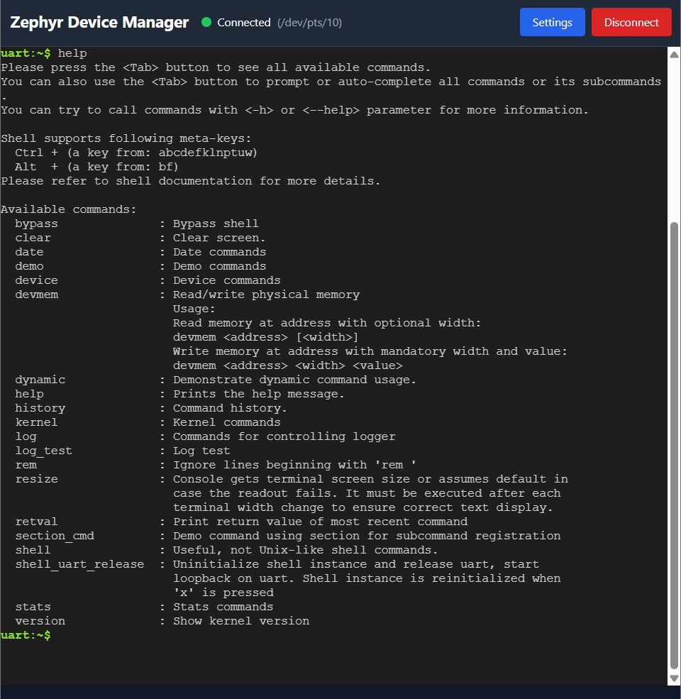

# Zephyr Device Manager (ZDM)

A web-based serial terminal application for Zephyr RTOS development and debugging.




## Features

- **Serial Port Communication**: Connect to Zephyr devices via serial ports
- **Real-time Terminal**: Interactive terminal using xterm.js
- **Web-based Interface**: Simple Alpine.js frontend, no build step required
- **Settings Panel**: Easy configuration of serial port and baud rate

## Requirements

- Python 3.10+
- pip (Python package manager)
- Serial port access (USB serial adapter or built-in serial port)

## Installation

1. Clone the repository:
```bash
git clone <repository-url>
cd zdm
```

2. Create and activate a Python virtual environment:

**Windows:**
```bash
cd backend
python -m venv venv
venv\Scripts\activate
```

**Linux/Mac:**
```bash
cd backend
python3 -m venv venv
source venv/bin/activate
```

3. Install backend dependencies:
```bash
pip install -r requirements.txt
```

## Running the Application

1. Activate the virtual environment (if not already activated):

**Windows:**
```bash
cd backend
venv\Scripts\activate
```

**Linux/Mac:**
```bash
cd backend
source venv/bin/activate
```

2. Start the backend server:

**Option 1: Using Python module**
```bash
python -m app.main
```

**Option 2: Using uvicorn directly**
```bash
uvicorn app.main:app --reload --host 0.0.0.0 --port 8000
```

**Option 3: Using startup scripts**
- Windows: `start.bat`
- Linux/Mac: `./start.sh` (make sure it's executable: `chmod +x start.sh`)

3. Open your web browser and navigate to:
```
http://localhost:8000
```

## Deactivating the Virtual Environment

When you're done working, you can deactivate the virtual environment:
```bash
deactivate
```

## Usage

1. Click the "Settings" button to configure the serial port connection
2. Select your serial port from the dropdown (click "Refresh" to reload available ports)
3. Select the baud rate (default: 115200)
4. Click "Connect" to establish the connection
5. Start typing commands in the terminal - they will be sent to your Zephyr device
6. Device output will appear in real-time in the terminal

## API Endpoints

### REST API

- `GET /api/ports` - List available serial ports
- `POST /api/connect` - Connect to a serial port
  ```json
  {
    "port": "COM3",
    "baudrate": 115200
  }
  ```
- `POST /api/disconnect` - Disconnect from serial port
- `GET /api/status` - Get connection status

### WebSocket

- `WS /ws` - WebSocket endpoint for real-time serial communication
  - Send text data to write to serial port
  - Receive text data from serial port

## Project Structure

```
zdm/
├── backend/
│   ├── app/
│   │   ├── main.py              # FastAPI application
│   │   ├── api/                 # API routes
│   │   │   ├── routes.py        # REST API endpoints
│   │   │   └── websocket.py     # WebSocket handler
│   │   ├── services/            # Business logic
│   │   │   └── serial_manager.py
│   │   └── backends/            # Communication backends
│   │       ├── base.py          # Base backend interface
│   │       └── serial_backend.py # Serial port implementation
│   └── requirements.txt
├── frontend/
│   ├── index.html               # Main HTML page
│   └── js/
│       └── app.js               # Alpine.js application
└── architecture.md              # Architecture documentation
```

## Development

### Backend

The backend is built with FastAPI and uses pyserial for serial port communication.

**Important:** Always activate the virtual environment before working on the backend:
```bash
cd backend
source venv/bin/activate  # Linux/Mac
# or
venv\Scripts\activate     # Windows
```

### Frontend

The frontend uses:
- **Alpine.js** - Lightweight reactive framework (no build step)
- **xterm.js** - Terminal emulator
- **TailwindCSS** - Utility-first CSS (via CDN)

No build tools or npm required - just edit the HTML/JS files and refresh!

## Troubleshooting

### Serial Port Not Found

- Make sure your device is connected
- Check if the serial port is available in Device Manager (Windows) or `ls /dev/tty*` (Linux)
- Click "Refresh" in the settings panel to reload available ports

### Connection Failed

- Verify the port name is correct (e.g., `COM3` on Windows, `/dev/ttyUSB0` on Linux)
- Check if another application is using the serial port
- Verify the baud rate matches your device configuration

### WebSocket Connection Issues

- Make sure the backend server is running
- Check browser console for errors
- Verify firewall settings allow WebSocket connections

## License

[Your License Here]

## Contributing

[Contributing Guidelines Here]
